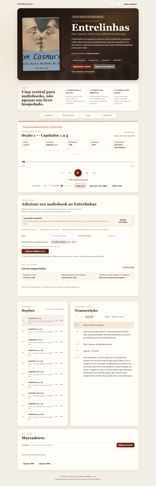
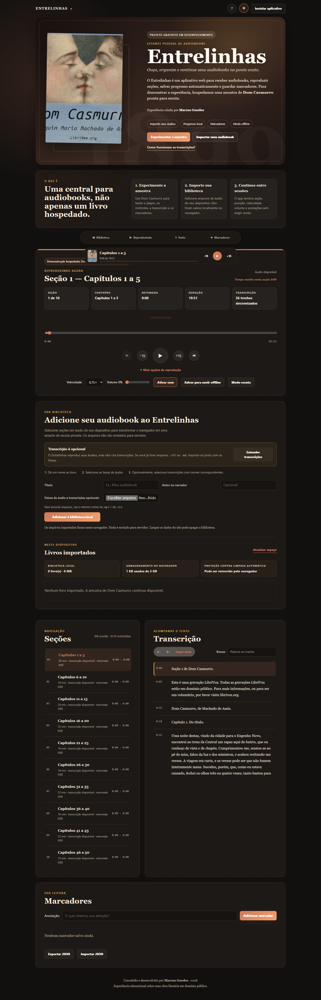

# Entrelinhas — Estante pessoal de audiobooks

Entrelinhas é um aplicativo web instalável para ouvir, organizar e retomar audiobooks. Ele funciona como uma estante privada no navegador: o usuário pode experimentar uma obra demonstrativa hospedada pelo projeto, importar seus próprios arquivos de áudio, salvar progresso por seção e criar marcadores.

O projeto usa **Dom Casmurro**, de Machado de Assis, como amostra pública para demonstrar a experiência de escuta. A proposta principal, porém, é ser uma interface reutilizável para receber audiobooks do próprio usuário.

> Status: projeto gratuito em desenvolvimento. A aplicação já é funcional, mas ainda está evoluindo em organização de biblioteca, transcrições e empacotamento de audiobooks.

Criado por **Marcus Guedes**.

## Prévia





## Por que este projeto existe

A ideia nasceu durante um intensivão de JavaScript, inicialmente como um player de audiobook. A partir desse ponto, o projeto foi expandido livremente até se tornar uma PWA com foco em leitura/escuta contínua, privacidade local e manutenção segura de catálogo. Para portfólio, o projeto demonstra domínio de frontend sem framework, APIs nativas do navegador, Service Worker, IndexedDB, acessibilidade básica, automação em Python e publicação via GitHub Pages.

## Funcionalidades

- Player customizado com play/pause, avançar/voltar 15 segundos e navegação entre seções.
- Progresso automático por seção, persistido localmente.
- Registro local de tempo ouvido.
- Controle de velocidade e volume com persistência.
- Marcadores com anotação, exportação e importação em JSON.
- Transcrição WebVTT quando disponível.
- Busca na transcrição.
- Modo noturno e modo escuta.
- Ajuda integrada com instruções rápidas de uso e privacidade local.
- Importação local de audiobooks e transcrições `.vtt` ou `.md` via IndexedDB.
- Biblioteca local em cards, com abertura por livro, exclusão e estimativa de armazenamento.
- Miniplayer responsivo para continuar controlando o áudio durante a navegação.
- Ajuste do tamanho da transcrição e controle para seguir o trecho reproduzido.
- Modo offline via Service Worker para app shell e seções selecionadas em produção.
- Servidor Python local com cabeçalhos de segurança.
- Validador Python para catálogo, caminhos de mídia e transcrições.

## Stack e APIs usadas

- HTML, CSS e JavaScript modular sem framework.
- Service Worker e Cache API para modo offline.
- IndexedDB para biblioteca local de audiobooks importados.
- LocalStorage para preferências, progresso e marcadores.
- WebVTT para transcrição sincronizada.
- Python standard library para servidor, validação e testes.
- GitHub Actions + GitHub Pages para publicação.

## Estrutura principal

```text
Entrelinhas/
  index.html
  style.css
  sw.js
  audios/
    1.mp3
    ...
    10.mp3
  data/
    catalog.json
  imagens/
    dom-casmurro.jpeg
    icon.svg
  js/
    app.js
    catalog.js
    library.js
    storage.js
    transcript.js
  transcripts/
    1.md
    secao-01.vtt
    ...
    10.md
    secao-10.vtt
tools/
  audiobook.py
  md_to_vtt.py
tests/
  test_audiobook.py
```

## Rodando localmente

Use o servidor do próprio projeto. Ele serve a pasta pública correta (`Entrelinhas`) e envia cabeçalhos compatíveis com a PWA.

```powershell
python tools\audiobook.py catalog
python tools\audiobook.py validate
python tools\audiobook.py serve --port 8000
```

Depois abra:

```text
http://127.0.0.1:8000
```

Evite abrir `index.html` direto por `file://` ou servir a raiz errada do repositório com outro servidor. Isso pode quebrar catálogo e caminhos de mídia. Em `localhost`, o app remove service workers antigos para evitar cache preso durante desenvolvimento.

## Transcrições

O app consome preferencialmente arquivos WebVTT (`.vtt`). Para edição manual, mantenha também os Markdown (`.md`) como fonte textual e gere os `.vtt` com o script do projeto.

### 1. Transcrições da amostra hospedada

Coloque os arquivos em:

```text
Entrelinhas/transcripts/
```

Cada arquivo de áudio da amostra é uma seção, e cada seção contém vários capítulos literários. Os arquivos públicos usam o número da seção:

```text
Entrelinhas/transcripts/secao-01.vtt
Entrelinhas/transcripts/secao-02.vtt
Entrelinhas/transcripts/secao-10.vtt
```

O fluxo atual do projeto usa `1.md` a `10.md` como fonte editável e gera arquivos públicos `secao-01.vtt` a `secao-10.vtt`. Isso evita cache antigo de navegador e deixa claro que os áudios são seções, não capítulos isolados. Se editar os arquivos `.md`, gere os `.vtt` antes de atualizar o catálogo:

```powershell
python tools\md_to_vtt.py
python tools\audiobook.py catalog
python tools\audiobook.py validate
```

O comando atualiza `Entrelinhas/data/catalog.json` para apontar para os arquivos encontrados.

### 2. Transcrições ao importar um audiobook pelo navegador

No formulário “Adicione seu audiobook ao Entrelinhas”, selecione os arquivos de áudio e as transcrições `.vtt` ou `.md` juntos. O pareamento é feito pelo nome:

```text
1.mp3  -> 1.vtt
01.mp3 -> 01.vtt
capitulo-1.mp3 -> capitulo-1.vtt
```

Os arquivos importados ficam no navegador do usuário via IndexedDB; nada é enviado para servidor.

## Se o áudio não tocar no localhost

Se aparecer uma mensagem de reprodução bloqueada ou áudio indisponível:

1. Pare e suba novamente o servidor com `python tools\audiobook.py serve --port 8000`.
2. Abra `http://127.0.0.1:8000`, não `file://`.
3. Faça um hard reload no navegador.
4. Se persistir, abra `http://127.0.0.1:8000/reset.html` para limpar caches antigos e reabrir o app.

O Service Worker responde a requisições parciais (`Range`) usadas por players de áudio em produção. Em localhost, o app desregistra service workers antigos para evitar que catálogo, áudio ou transcrições fiquem presos em cache durante desenvolvimento.

## Scripts úteis

```powershell
npm run catalog
npm run icons
npm run transcripts
npm run validate
npm test
npm run test:e2e
npm run serve
npm run screenshots
```

Para lint e formatação, instale as dependências de desenvolvimento antes:

```powershell
npm install
npm run lint
npm run format
```

## Validação

Antes de publicar ou abrir pull request, rode:

```powershell
python tools\audiobook.py validate
python -m unittest discover -s tests
npm run lint
npm run test:e2e
```

O workflow de deploy também executa essas validações antes de publicar no GitHub Pages.

## Checklist de release

Antes de subir ao GitHub ou publicar:

```powershell
npm run icons
npm run transcripts
npm run catalog
npm run validate
npm test
npm run lint
npm run test:e2e
npm run screenshots
```

Depois, confira manualmente:

- seção 1 exibe a transcrição completa, incluindo “Capítulo 5. O agregado”;
- seção 2 troca corretamente para “Capítulos 6 a 10”;
- áudio responde ao play no localhost e o tempo de reprodução avança;
- o botão “?” abre e fecha a ajuda “Como usar o Entrelinhas”;
- modo noturno e modo escuta funcionam;
- `docs/screenshots/` está atualizado.

## Publicando no GitHub Pages

O workflow em `.github/workflows/deploy.yml` publica a pasta `Entrelinhas` quando houver push para `main` ou `master`.

Checklist antes de subir:

- confirme a origem/licença dos arquivos em `Entrelinhas/audios/` e `Entrelinhas/imagens/`;
- rode validação e testes;
- confira se nenhum artefato local (`__pycache__`, logs, `node_modules`) foi versionado;
- em Settings > Pages do repositório, use GitHub Actions ou a branch `gh-pages`, conforme a configuração do repositório;
- depois do primeiro deploy, teste a URL pública em aba anônima para validar Service Worker, áudio e transcrições.
- na URL pública, confira também o botão “?”, o botão de instalação do PWA e o salvamento offline de uma seção.

## Segurança e privacidade

- Arquivos importados pelo usuário ficam no próprio navegador via IndexedDB.
- Nenhum áudio importado é enviado para servidor.
- A interface evita `innerHTML` para conteúdo dinâmico e constrói a UI com APIs seguras de DOM.
- A política CSP restringe scripts, mídia, imagens e conexões à própria origem.
- O servidor Python local adiciona cabeçalhos como CSP, `X-Content-Type-Options`, `Referrer-Policy` e `Permissions-Policy`.
- Não há tokens ou chaves secretas no frontend.
- O projeto não coleta dados do usuário e não tem backend próprio nesta versão.

## Roadmap

O roadmap detalhado de produto, biblioteca, importação, transcrições, UI/UX e testes está em
[`docs/UX_ROADMAP.md`](docs/UX_ROADMAP.md).

- Revisar tempos reais das transcrições `.vtt` com alinhamento mais preciso.
- Permitir edição visual da ordem e dos nomes das seções importadas.
- Adicionar capa personalizada por audiobook importado.
- Exportar/importar pacotes completos de biblioteca.
- Criar testes automatizados para funções JavaScript puras.

## Créditos e direitos

Dom Casmurro é uma obra em domínio público. Os arquivos de áudio, capa e eventuais transcrições devem ter origem e licença compatíveis antes de publicação. Se os áudios forem de terceiros, inclua a atribuição correspondente nesta seção antes de subir o projeto ao GitHub.

As gravações usadas na amostra indicam origem LibriVox nas próprias transcrições. Antes de publicar, mantenha no repositório apenas áudios, capa e textos com licença compatível e preserve a atribuição da narradora/da fonte quando aplicável.

A intenção do Entrelinhas é permitir uso gratuito por outras pessoas. O código está licenciado sob MIT em `LICENSE`. Essa licença cobre o código do projeto; obras, áudios, capas e transcrições devem manter créditos e licenças próprios.
